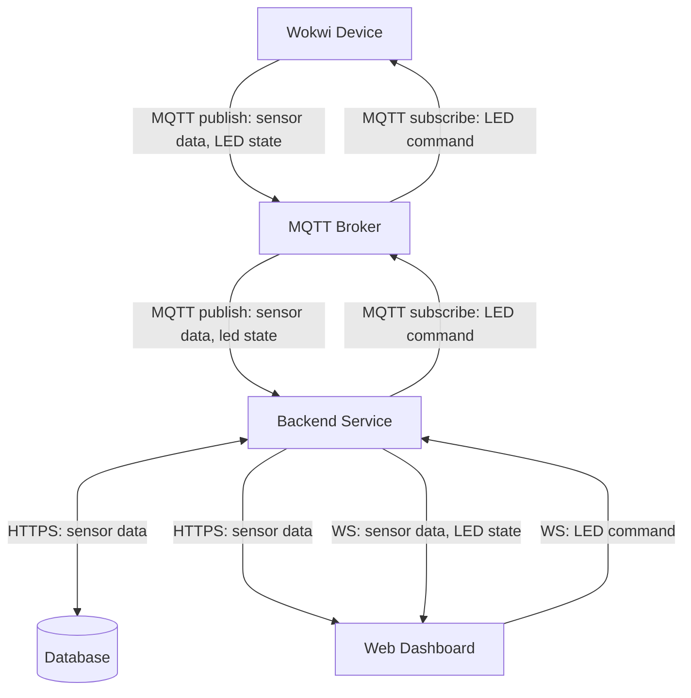

# Assignment: Internet of Things (IoT)
  
## Project Links
- **Live Dashboard URL:** [Dashboard](https://iot-sensor.up.railway.app/)
- **Wokwi Simulation URL:** [Wokwi](https://wokwi.com/projects/465088340700419073)
- **Frontend & Backend Repository URL:** [Repository](https://gitlab.lnu.se/1dv027/student/al227bn/exercises/assignment-iot)
- **Grafana Dashboard URL:** [Grafana](https://aangelinux.grafana.net/public-dashboards/68b52a9554e142bcbbe8b1b3b029e55b)

---
## Project Overview
This project features a full IoT pipeline that collects and visualizes temperature & humidity data. The hardware consists of an ESP32 microcontroller with a DHT22 sensor and LED component, simulated in Wokwi. It publishes sensor data and LED state to an MQTT broker hosted by HiveMQ Cloud, and subscribes to commands by turning the LED on and off. A backend service reads the data from the broker and writes it to a database hosted by InfluxDB Cloud, before sending it to the frontend service over a WebSocket connection, so it can be visualized on a dashboard.  
  
In addition, the project uses Telegraf to inject sensor data from the broker directly into the database. The data is then visualized on a Grafana dashboard consisting of real-time, historical, and aggregated data-panels.  
  
#### Demo
It should be possible to turn on the Wokwi simulation and use the Dashboard without doing anything else, but if not:  
  
  
  

---  
## Architecture and Data Flow
- **Sensor Data**: Wokwi Device -> MQTT Broker -> Backend/Database -> (HTTPS, WS) -> Dashboard
- **LED State**: Wokwi Device -> MQTT Broker -> Backend -> (WS) -> Dashboard
- **LED Command**: Dashboard -> (WS) -> Backend -> MQTT Broker -> Wokwi Device


  
---
## Database Strategy
- **Database chosen:** InfluxDB  
- **Data access layer:** Path A (Custom API)  
  
- **Data model:** 
  - **Source:**  
    InfluxDB Cloud, bucket: iot_assignment, measurement: climate    
    
  - **Schema:**  
    time: string  
    temperature: float  
    humidity: float  
    
  - **Query:**  
    GET https://iot-backend-api.up.railway.app/api/data/historical  
        
    Parameters: limit (optional)    
    
  - **Response:**  
    { message: { time: string, temperature: float, humidity: float }[] }   
    
- **Time-series considerations:** The bucket uses a 30-day retention period. In the backend, data queries are by default limited to 100 rows value and sorted by time, from most recent to last.  
  
  
---
## MQTT Topics and Payload Documentation
### Sensor Data (published by Wokwi)
- **Topic:** `lnu/iot/al227bn/sensor`
- **Example Payload (JSON):**

```json
{
  "temperature": 30,
  "humidity": 70,
  "time": "2026-05-19T11:00:00"
}
```
---
  
  
### LED State (published by Wokwi)
- **Topic:** `lnu/iot/al227bn/led/state`
- **Example Payload (JSON):**

```json
{
  "ledState": "ON"
}
```
---
  
  
### LED Commands (published by dashboard)
- **Topic:** `lnu/iot/al227bn/command/led`
- **Example Payload (JSON):**

```json
{
  "msg": "ON"
}
```

---
## Reflection
**Technologies used:**  
- React: Simple and flexible for creating user-friendly frontend applications.
- Chart.js: Creates dynamic and good-looking charts.
- FastAPI: Flexible and lightweight, suitable for a simple backend like this one.
- HiveMQ Cloud: Reliable and secure; has support for SSL/TLS, and keeps the broker running 24/7.
- InfluxDB Cloud: Serverless and easy to set up. 
   
**Real-time Data vs Standard REST APIs:**  
Handling real-time data over WebSocket differs from a standard API workflow in many ways; your code must ensure that the WebSocket and MQTT connections stay open and attempt to reconnect if something goes wrong. You must also handle concurrency issues as data is constantly being received or published at very short intervals, and since standard workflow is often synchronous you have to make sure that the program is not being blocked by a synchronous operation. You also need to ensure that the data format is correct and consistent on each end to avoid parsing issues.  
  
**Challenges:**  
There were many challenging integration steps in this assignment. Using a broker was initially very challenging since it was new for me, and connecting both the Wokwi device and the backend to it was difficult but solved after some debugging and reading documentation of MQTT client libraries. Switching from a public broker to HiveMQ Cloud also proved challenging later as it involved handling credentials and setting up a secure connection with SSL/TLS.  
  
---
## VG-A TIG Stack
#### Demo
  
  
#### Security Considerations
Access to the MQTT broker requires username and password. All secrets such as InfluxDB token and broker credentials are stored as environment variables and **not** pushed to the remote repository. In addition, the Grafana Dashboard requires admin permission to edit; it is read-only for all other viewers.  
  
Initially I had the frontend communicate directly with the MQTT broker over WebSocket, but after switching to a HiveMQ broker with credentials I moved this communication to the server instead. This way the server forwards realtime data to the client via WebSocket, to avoid exposing credentials in client-code.  
  
#### Technical Reflection
Using the TIG-stack was much less time-consuming than building a backend and frontend from scratch. Although building a custom backend allowed more flexiblity, using the TIG-stack simplified the IoT pipeline noticeably and did not require writing any code.
  