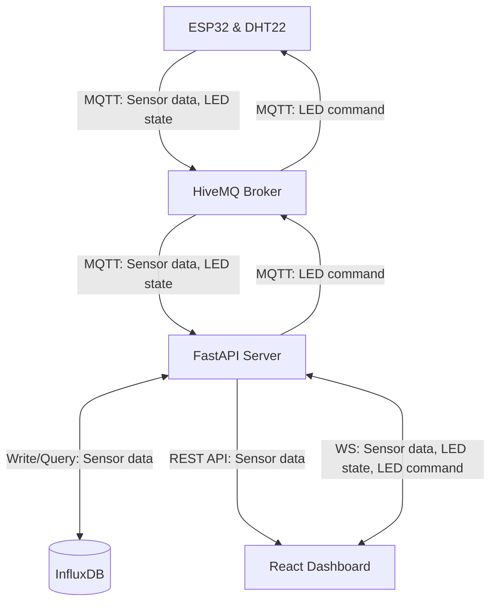

# Assignment: Internet of Things (IoT)
  
## Project Links
- **Live Dashboard URL:** [Dashboard](https://iot-sensor.up.railway.app/)
- **Wokwi Simulation URL:** [Wokwi](https://wokwi.com/projects/465088340700419073)
- **Frontend & Backend Repository URL:** [Repository](https://gitlab.lnu.se/1dv027/student/al227bn/exercises/assignment-iot)
- **Grafana Dashboard URL:** [Grafana](https://aangelinux.grafana.net/public-dashboards/68b52a9554e142bcbbe8b1b3b029e55b)

---
## Project Overview
This project features a full IoT pipeline that collects and visualizes temperature & humidity data. The hardware consists of an ESP32 microcontroller with a DHT22 sensor and LED component, simulated in Wokwi. The ESP32 publishes sensor readings and current LED state to a HiveMQ Cloud MQTT broker. It also subscribes to LED commands, allowing the dashboard to remotely toggle the LED on and off. The backend reads the data from the broker and writes it to an InfluxDB Cloud bucket, before forwarding it to the frontend over WebSocket.  
  
The project also uses Telegraf to inject sensor data from the broker into a separate InfluxDB bucket. Grafana queries this bucket directly and visualizes the data on a dashboard consisting of real-time, historical, and aggregated data-panels.  
  
### Deployment
| Component | Platform       |
| --------- | -------------- |
| Frontend  | Railway        |
| Backend   | Railway        |
| Broker    | HiveMQ Cloud   |
| Database  | InfluxDB Cloud |
| Hardware  | Wokwi          |

### Demo
It should be possible to turn on the Wokwi simulation and use the Dashboard without doing anything else, but if not:  
  
  
  

---  
## Architecture and Data Flow
- **Sensor Data**: Wokwi Device -> MQTT Broker -> Backend/Database -> (HTTPS, WS) -> Dashboard
- **LED State**: Wokwi Device -> MQTT Broker -> Backend -> (WS) -> Dashboard
- **LED Command**: Dashboard -> (WS) -> Backend -> MQTT Broker -> Wokwi Device


  
---
## Database Strategy
- **Database chosen:** InfluxDB  
- **Data access layer:** Path A (Custom API)  
  
- **Data model:** 
  - **Sources:**  
    Custom API: bucket: iot_assignment, measurement: climate  
    TIG-Stack: bucket: iot_telegraf, measurement: mqtt_consumer  

  - **Query (custom API):**  
    GET https://iot-backend-api.up.railway.app/api/data/historical  
        
    Parameters: limit (optional)    
    
  - **Schema:**  
    time: string  
    temperature: float  
    humidity: float  
    
  - **Response:**  
    { time: string, temperature: float, humidity: float }[]   
    
- **Time-series considerations:** The bucket uses a 30-day retention period. In the backend, data queries are limited to 100 rows by default and sorted by time, from most recent to last.  
  
  
---
## MQTT Topics and Payloads
### Sensor Data (published by Wokwi)
- **Topic:** `lnu/iot/al227bn/sensor`
- **Example Payload (JSON):**

```json
{
  "temperature": 30,
  "humidity": 70,
  "time": "2026-05-19T11:00:00"
}
```
---
  
  
### LED State (published by Wokwi)
- **Topic:** `lnu/iot/al227bn/led/state`
- **Example Payload (JSON):**

```json
{
  "ledState": "ON"
}
```
---
  
  
### LED Commands (published by dashboard)
- **Topic:** `lnu/iot/al227bn/command/led`
- **Example Payload (JSON):**

```json
{
  "msg": "ON"
}
```

---
## WebSocket Payloads
### Sensor Data
```json
{
  "type": "sensor",
  "data": {
    "time": "2026-05-28T16:09:00",
    "temperature": 20.0,
    "humidity": 50.0
  }
}
```
  
### LED State
```json
{
  "type": "ledState",
  "data": {
    "ledState": "ON"
  }
}
```
  
### LED Commands
```json
{
  "msg": "ON"
}
```
  
---
## Reflection
**Frontend technologies used:**  
To build the frontend, I chose React as a framework because it's simple to use and versatile for building user-friendly applications. I also chose to use TypeScript because of the added type-safety compared to JavaScript. To display sensor data, I used Chart.js because it's flexible and makes it easy to create responsive and nice-looking charts.
   
**Real-time Data vs Standard REST APIs:**  
Handling real-time data over WebSocket differs from a standard API workflow in many ways. In traditional REST APIs, the client only fetches data when it's needed, whereas real-time data is transmitted as soon as an event occurs. The program must ensure the connection stays open, attempt to reconnect if something fails, and handle messages asynchronously to avoid blocking the program. Network- and concurrency issues can make this more challenging than using standard API workflows. However, using real-time data made the application more dynamic and useful for viewers.  
  
**Challenges:**  
One of the most challenging aspects of this assignment was setting up the broker and making it communicate with all necessary components. It was also challenging initially to understand the pipeline from Wokwi simulation -> Dashboard since it involves multiple components that must work together. What helped was drawing out the architecture to visualize where each part is located and what it should do. It was also helpful to document data formats to prevent mismatched data while it's being passed from one component to the next.  
  
---
## VG-A TIG Stack
### Demo
  
  
### Security Considerations
To make MQTT communication secure, access to the broker requires credentials and all communication is encrypted with TLS. Access to InfluxDB is restricted with API tokens. Grafana Dashboard requires admin permissions to edit and is read-only for viewers by default. Secrets, eg credentials and tokens, are injected through environment variables and **not** committed to version control.  
  
I initially set up the frontend to communicate directly with the MQTT broker over WebSocket, but after switching to a protected HiveMQ broker I moved MQTT communication to the server instead, to avoid exposing credentials in client-code.   
  
### Technical Reflection
Using the TIG-stack made implementation a lot easier and faster at the cost of some flexibility, and the pipeline became much simpler without the need for a custom backend. Grafana also provided multiple options for visualizing data without requiring a custom frontend.
  