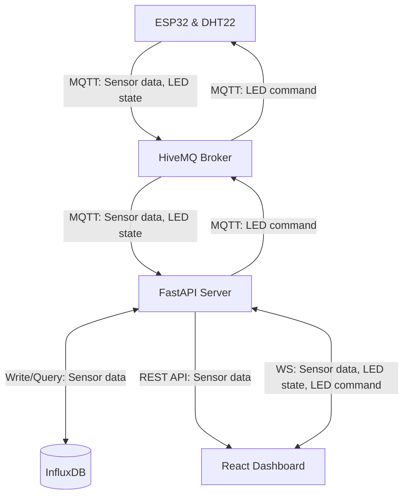

# Temperature & Humidity Sensor

---
## Introduction
This project features a full IoT pipeline that collects and visualizes temperature & humidity data. The hardware consists of an ESP32 microcontroller with a DHT22 sensor and LED component, simulated in Wokwi. The ESP32 publishes sensor readings and current LED state to a HiveMQ Cloud MQTT broker. It also subscribes to LED commands, allowing the dashboard to remotely toggle the LED on and off. The backend reads the data from the broker and writes it to an InfluxDB Cloud bucket, before forwarding it to the frontend over WebSocket.  

---
### Screenshots

  
---
### Deployment
| Component | Platform       |
| --------- | -------------- |
| Frontend  | Railway        |
| Backend   | Railway        |
| Broker    | HiveMQ Cloud   |
| Database  | InfluxDB Cloud |
| Hardware  | Wokwi          |

---  
## Architecture and Data Flow
- **Sensor Data**: Wokwi Device -> MQTT Broker -> Backend/Database -> (HTTPS, WS) -> Dashboard
- **LED State**: Wokwi Device -> MQTT Broker -> Backend -> (WS) -> Dashboard
- **LED Command**: Dashboard -> (WS) -> Backend -> MQTT Broker -> Wokwi Device

