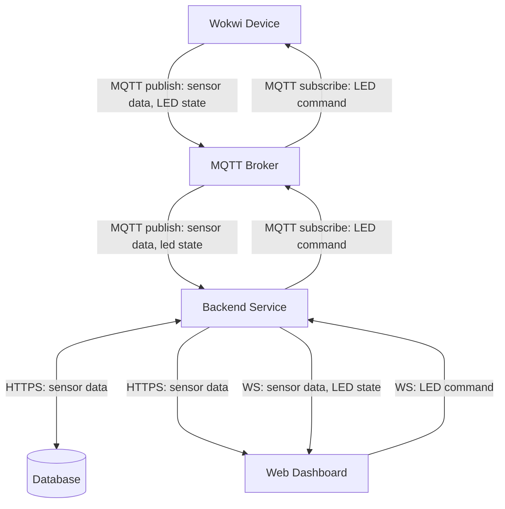

# Assignment: Internet of Things (IoT)
  
## Project Links
- **Live Dashboard URL:** [Dashboard](https://iot-sensor.up.railway.app/)
- **Wokwi Simulation URL:** [Wokwi](https://wokwi.com/projects/465088340700419073)
- **Frontend & Backend Repository URL:** [Repository](https://gitlab.lnu.se/1dv027/student/al227bn/exercises/assignment-iot)
- **Grafana Dashboard URL:** [Grafana](https://aangelinux.grafana.net/public-dashboards/68b52a9554e142bcbbe8b1b3b029e55b)


## Project Overview
This project features a full IoT pipeline that collects and visualizes temperature & humidity data. The hardware consists of an ESP32 microcontroller with a DHT22 sensor and LED component, simulated in Wokwi. It publishes sensor data and LED state to an MQTT broker hosted by HiveMQ Cloud, and subscribes to commands by turning the LED on and off. A backend service reads the data from the broker and writes it to a database hosted by InfluxDB Cloud, before sending it to the frontend service over a WebSocket connection, so it can be visualized on a dashboard.  
  
In addition, the project uses Telegraf to inject sensor data from the broker directly into the database. The data is then visualized on a Grafana dashboard consisting of real-time, historical, and aggregated data-panels.  
  
### Demo
It should be possible to turn on the Wokwi simulation and use the Live Dashboard without doing anything else, but otherwise:  
  
  
  
  
## Architecture and Data Flow
- **Sensor Data**: Wokwi Device -> MQTT Broker -> Backend/Database -> (HTTPS, WS) -> Dashboard
- **LED State**: Wokwi Device -> MQTT Broker -> Backend -> (WS) -> Dashboard
- **LED Command**: Dashboard -> (WS) -> Backend -> MQTT Broker -> Wokwi Device




## Database Strategy
- **Database chosen:** InfluxDB  
- **Data access layer:** Path A (Custom API)  
  
- **Data model:** 
  
  - **Query:**  
    GET {url}/api/data/?limit=20  
    Limit param is optional.  
  
  - **Response:**  
    { time: string, temperature: float, humidity: float }[]  
  
- **Time-series considerations:** The table uses a 30-day retention period. In the backend, all data queries are limited to 100 rows or a user-specified value and sorted by most recent entries.  
  

## MQTT Topics and Payload Documentation
### Sensor Data (published by Wokwi)
- **Topic:** `lnu/iot/al227bn/sensor`
- **Example Payload (JSON):**

```json
{
  "temperature": 30,
  "humidity": 70,
  "time": "2026-05-19T11:00:00"
}
```
---
  
  
### LED State (published by Wokwi)
- **Topic:** `lnu/iot/al227bn/led/state`
- **Example Payload (JSON):**

```json
{
  "ledState": "ON"
}
```
---
  
  
### LED Commands (published by dashboard)
- **Topic:** `lnu/iot/al227bn/command/led`
- **Example Payload (JSON):**

```json
{
  "msg": "ON"
}
```
---


### Reflection
**Technologies used:**  
- React: 
- Chart.js: 
- Vite: 
- FastAPI: 
- HiveMQ Cloud: 
- InfluxDB Cloud: 
- Telegraf: 
- Grafana: 
  
2. How does handling real-time MQTT data over WebSockets differ from a standard REST API workflow?  


3. What was the most challenging integration step (hardware, broker, backend, database, frontend), and how did you solve it?  


## VG-A TIG Stack
### Security Considerations


  
### Demo
  

  
### Reflection


### Grading Policy Mapping

- **Mandatory (G) mapping:** Equivalent to completing Issue 1-7 in `ISSUES.md`.
- **Issue 4 path rule:** You must complete either Path A (custom API) or Path C (Node-RED historical access), and document your chosen approach.
- **Optional (VG) mapping:** Equivalent to completing at least one of VG-A, VG-B, or VG-C in `ISSUES.md`.

For any VG extension, include:
- Security considerations (secrets handling, credentials, access restrictions).
- Evidence (screenshots/video/logs) and short technical reflection.

