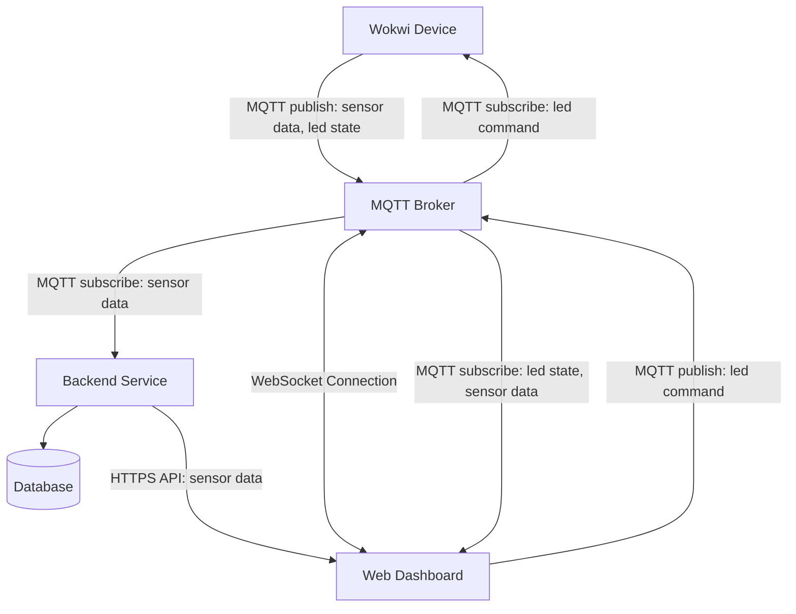

# Assignment: Internet of Things (IoT)
  
## Submission Report
  
### Project Links
- **Live Dashboard URL:** [Link to deployed frontend, e.g. Vercel/Netlify/Cumulus]
- **Wokwi Simulation URL:** [Public Wokwi project link]
- **Backend/Database URL:** [Link to deployed backend stack, if applicable]
- **Frontend & Backend Repository URL:** [Link to your source code]
- **Wokwi Simulation Repository URL:** [Link to Wokwi simulation source code]


### Project Overview
This project features a full IoT pipeline from hardware, to backend, to frontend. The hardware collects temperature & humidity data from a sensor and publishes it to an MQTT Broker. A backend service is set up to read the sensor data from the broker, store it in a database, and expose it via a REST API to be used by a web dashboard.  
  
The Wokwi simulation uses an ESP32 microcontroller with a DHT22 sensor and a simple LED component. The dashboard fetches historical sensor data from the backend and displays it on a line chart. It uses a WebSocket connection to read real-time sensor data & LED state from the MQTT Broker and update the chart dynamically. In addition, it provides a set of controls to modify the LED's current state.  
  

### Architecture and Data Flow
- **Sensor Data**: Wokwi Device -> MQTT Broker -> Backend/Database -> Dashboard
- **LED State**: Wokwi Device -> MQTT Broker -> Dashboard
- **LED Command**: Dashboard -> MQTT Broker -> Wokwi Device




### Database Strategy
- **Database chosen:** InfluxDB  
  
- **Data model:** 

**Table name: Climate**

| field       | value   |
| ----------- | ------- |
| temperature | float64 |
| humidity    | float64 |
| time        | string  |  
  
- **Time-series considerations:** The table uses a 30-day retention period. In the backend service, all data queries are limited to maximum 100 rows or a value chosen by the user. Queried data is sorted by time and returned as a list.  


### MQTT Topics and Payload Documentation
#### Sensor Data (published by Wokwi)
- **Topic:** `lnu/iot/al227bn/sensor`
- **Example Payload (JSON):**

```json
{
  "temperature": 30,
  "humidity": 70,
  "time": "2026-05-19T11:00:00"
}
```
---
  
  
#### LED State (published by Wokwi)
- **Topic:** `lnu/iot/al227bn/led/state`
- **Example Payload (JSON):**

```json
{
  "ledState": "ON"
}
```
---
  
  
#### Device Commands (published by dashboard, subscribed by Wokwi)
- **Topic:** `lnu/iot/al227bn/command/led`
- **Example Payload (JSON):**

```json
{
  "msg": "ON"
}
```
---


### Reflection
**Frontend technologies used:**  
- React for its simplicity in developing robust and user-friendly UIs
- Vite for its versatility & bundling capabilities
- Chart.js for its capabilites in creating dynamic and good-looking charts
  
2. How does handling real-time MQTT data over WebSockets differ from a standard REST API workflow?
3. What was the most challenging integration step (hardware, broker, backend, database, frontend), and how did you solve it?


### Grading Policy Mapping

- **Mandatory (G) mapping:** Equivalent to completing Issue 1-7 in `ISSUES.md`.
- **Issue 4 path rule:** You must complete either Path A (custom API) or Path C (Node-RED historical access), and document your chosen approach.
- **Optional (VG) mapping:** Equivalent to completing at least one of VG-A, VG-B, or VG-C in `ISSUES.md`.

For any VG extension, include:
- Security considerations (secrets handling, credentials, access restrictions).
- Evidence (screenshots/video/logs) and short technical reflection.

